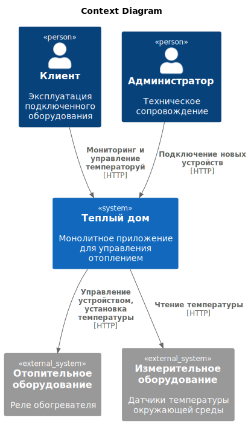
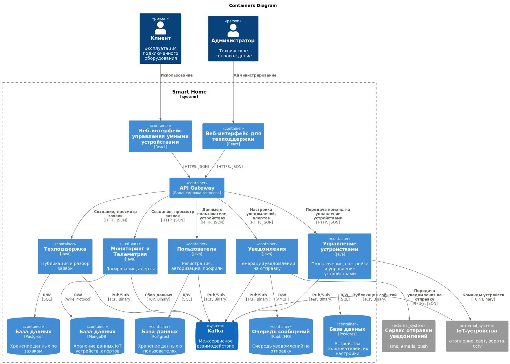
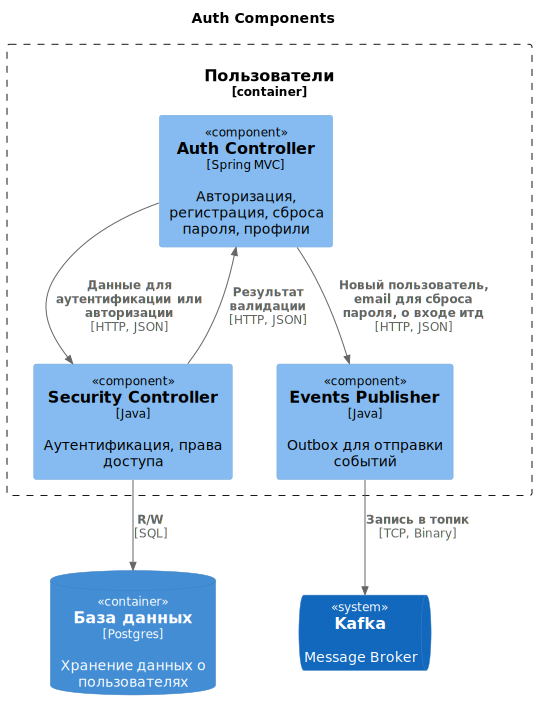
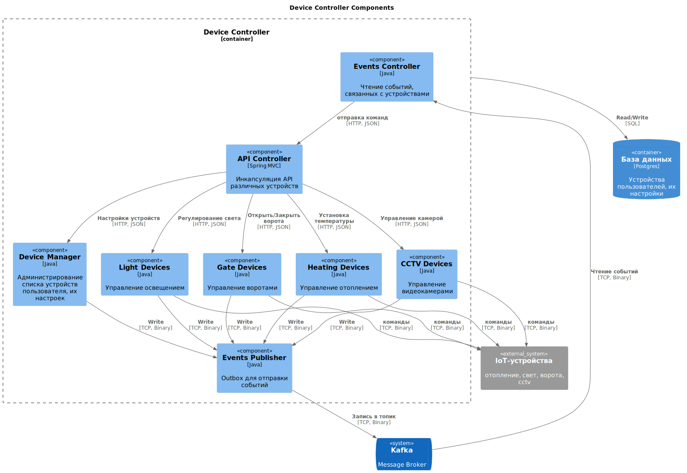
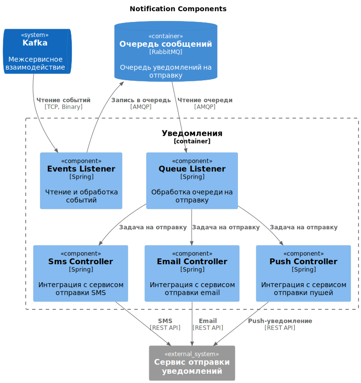
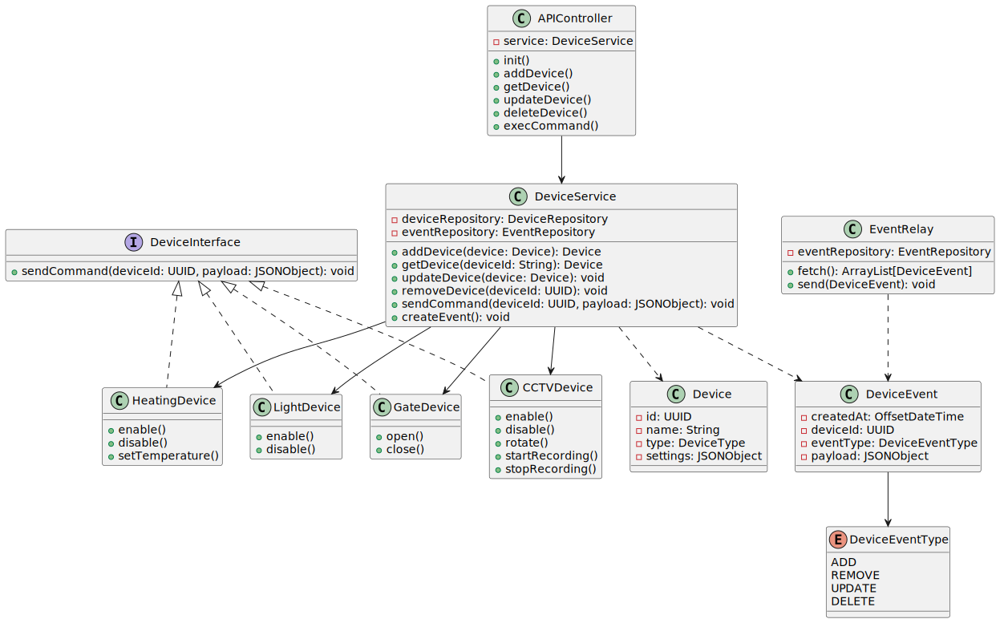
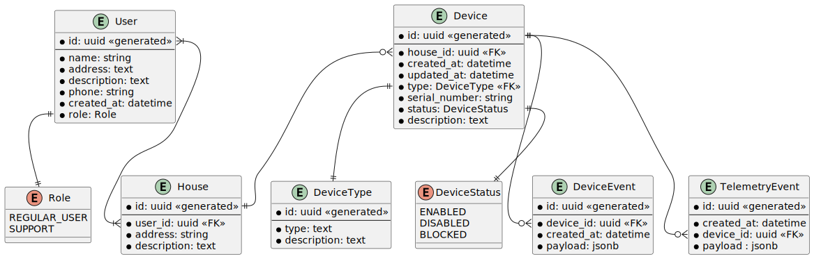

Это шаблон для решения **первой части** проектной работы. Структура этого файла повторяет структуру заданий. Заполняйте его по мере работы над решением.

# Задание 1. Анализ и планирование

Чтобы составить документ с описанием текущей архитектуры приложения, можно часть информации взять из описания компании условия задания. Это нормально.

### 1. Описание функциональности монолитного приложения

**Управление отоплением:**

- Пользователи могут удалённо включать/выключать отопление в своих домах.
- Пользователи могут выставить желаемую температуру в своих домах через веб-интерфейс.

**Мониторинг температуры:**

- Система получает данные о температуре с датчиков, установленных в домах.
- Пользователи могут просматривать текущую температуру в своих домах через веб-интерфейс. 

### 2. Анализ архитектуры монолитного приложения

- Язык программирования: Java 17
- База данных: PostgreSQL
- Архитектура: Монолитная, все компоненты системы (обработка запросов, бизнес-логика, работа с данными) находятся в рамках одного приложения.
- Взаимодействие: Синхронное, запросы обрабатываются последовательно.
- Масштабируемость: Ограничена, так как монолит сложно масштабировать по частям.
- Развёртывание: Требует остановки всего приложения.

### 3. Определение доменов и границы контекстов

- Управление устройствами: регистрация нового устройства, передача команд подключенным устройствам (например, включение/отключение отопления пользователем, установка целевой температуры, чтение текущей температуры)
- Телеметрия: сбор и хранение показаний устройств
- Управление пользователями: регистрация новых пользователей, редактирование данных пользователя
- Техподдержка: регистрация и обработка заявок от пользователей

### **4. Проблемы монолитного решения**

- Подключение нового устройства требует вызова специалиста на дом.
- Любое обновление требует остановки всего приложения.
- Добавление нового функционала требует полного регресса всего приложения.
- Пропущенный баг или сбой может привести к отказу всего функционала системы.
- Сложности масштабирования при росте кол-ва пользователей. Отсутствие балансировки нагрузки.

### 5. Визуализация контекста системы — диаграмма С4

# Задание 2. Проектирование микросервисной архитектуры

**Диаграмма контейнеров (Containers)**

**Диаграмма компонентов (Components)**

**Диаграмма кода (Code)**

# Задание 3. Разработка ER-диаграммы

